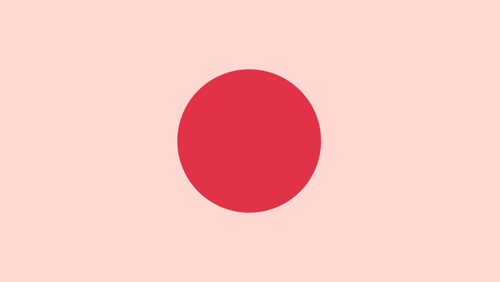
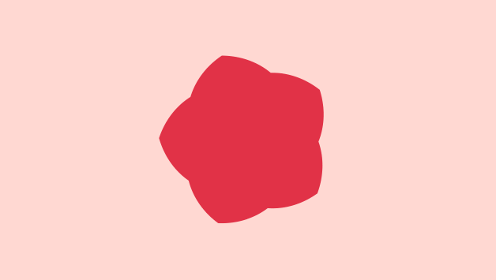
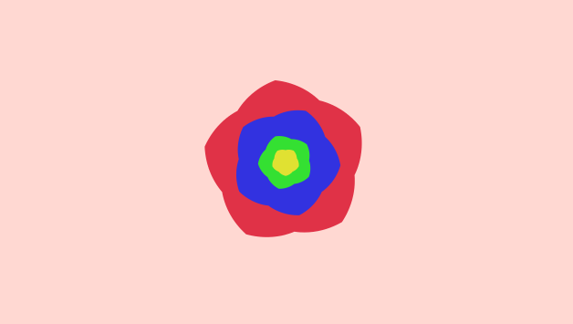

# Lab01: Toolbox Functions

In this lab I practiced using basic graphics related toolbox functions like bias, gain, waves, and noise to replicate the provided simple graphics in shadertoy.

|  |  |
|:--:|:--:|
|Example Pulsing Flower|My Replication [Here](https://www.shadertoy.com/view/WclBWn)|

|  |  |
|:--:|:--:|
|Example Spinning Flower|My Replication [Here](https://www.shadertoy.com/view/3flfWn)|

I then used these tools to create my own new flower!

|  |
|:--:|
|My New Flower [Here](https://www.shadertoy.com/view/WcsfWn)|